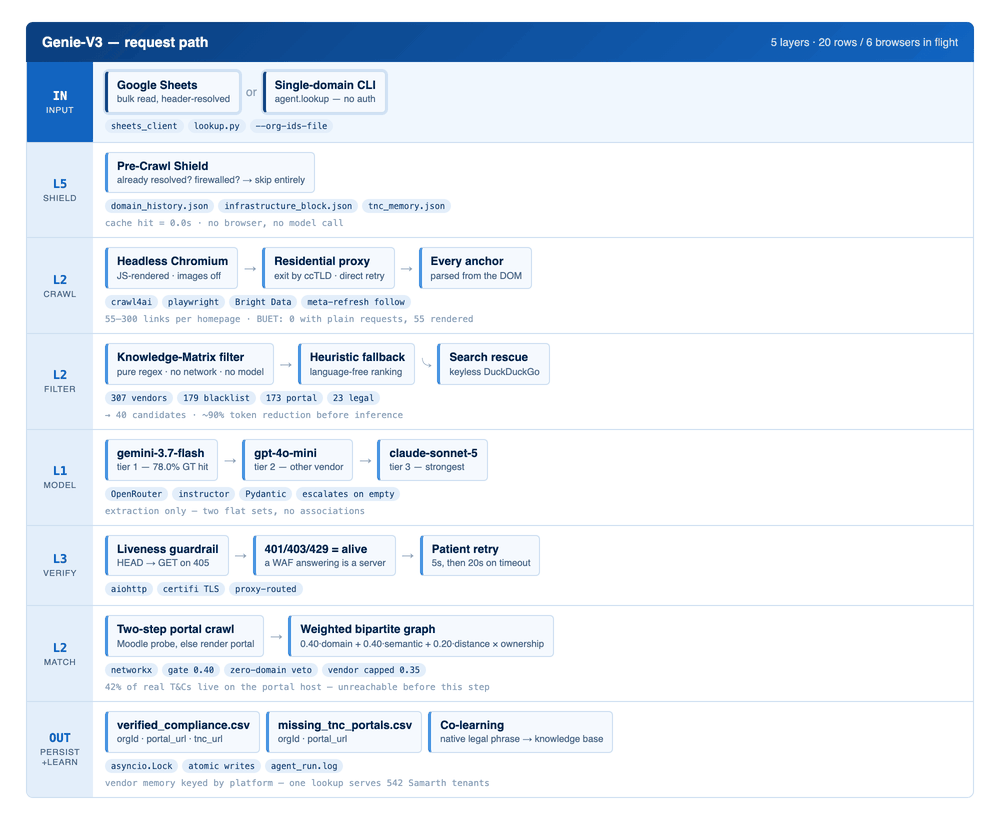
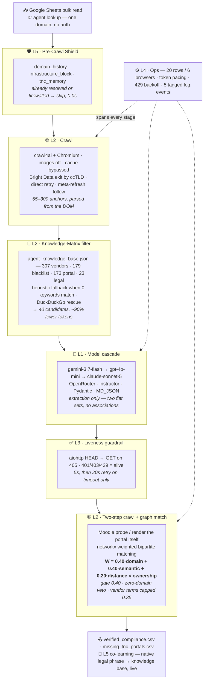

# reclaim-portal-agent

> ## 🕸️ Introducing Genie-V3
>
> The discovery engine has been rebuilt on a **five-layer architecture** —
> ~16,000 lines of rule engine replaced by **3,504 lines across 9 modules**.
>
> Two decisions moved out of the language model entirely: *which links are worth
> reading* (a knowledge-base filter) and *which legal document governs which
> portal* (a weighted bipartite graph matcher). The model is now a pure
> extraction parser.
>
> **Measured:** T&C recall **30% → 51%**; **119 of 465** organisations that V2
> found nothing for now have a portal; 26 languages learned on the fly.
>
> **V2 is still here, still running, still supported** — see
> [`agent/legacy/legacy_agent.README`](agent/legacy/legacy_agent.README).
> Every old import path works unchanged.

Genie finds the **student-login portal** for a university and the **terms &
privacy documents** that govern it, then writes both back to Google Sheets.
Output ships to SheerID as `orgId, portal url, tnc url`.

---

## Quickstart

```bash
python -m venv .venv && source .venv/bin/activate
pip install -r requirements.txt
playwright install chromium
cp .env.example .env          # fill OPENROUTER_API_KEY + Google creds

# V3 — run 200 organisations from a sheet tab
.venv/bin/python -m agent.v3_orchestrator \
    --sheet-id <SHEET_ID> --tab 'all orgs' --start-row 2 --count 200

# V3 — run a scattered list of org IDs instead of a row range
.venv/bin/python -m agent.v3_orchestrator \
    --sheet-id <SHEET_ID> --tab 'all orgs' --org-ids-file ids.json
```

### Look up a single university

No spreadsheet, no org ID, no OAuth — one domain in, portals and terms out.

```bash
# portals + the terms governing them
.venv/bin/python -m agent.lookup buet.ac.bd --name "Bangladesh University of Engineering & Technology"

# portals only — skips the portal crawl and graph matching, ~2x faster
.venv/bin/python -m agent.lookup unifran.edu.br --portals-only

# machine-readable
.venv/bin/python -m agent.lookup kbu.ac.th --json > result.json
```

```
  Bangladesh University of Engineering & Technology   (buet.ac.bd)
  ──────────────────────────────────────────────────────────────────
  [ERP]  BIIS
    portal : http://biis.buet.ac.bd/BIIS_WEB/Login.do
    terms  : https://bcc.buet.ac.bd/privacy-policy   (confidence 0.92, vertical-parent)
```

From Python:

```python
from agent.lookup import find_portals
result = await find_portals("buet.ac.bd", portals_only=True)
```

Exits non-zero when nothing is found, so it composes in shell scripts.

Results land in `output/`:

```
output/verified_compliance_<date>.csv    orgId, portal_url, tnc_url
output/missing_tnc_portals_<date>.csv    orgId, portal_url
output/agent_run_<date>.log              timestamped, one record per line
```

---

## 1. The five layers

| | Layer | Job | Module |
|---|---|---|---|
| **L1** | Model | Which model, and what happens when it fails | `openrouter_cascade.py` |
| **L2** | Wrapping | Crawl · filter · search · graph association | `crawler` · `filters` · `search_fallback` · `graph_matcher` |
| **L3** | Guardrails | Is the answer actually live? | `guardrails.py` |
| **L4** | Production | Concurrency, pacing, observability | `v3_orchestrator.py` |
| **L5** | Optimisation | Memory, caching, co-learning | `memory_cache.py` |

**Architecture**



<details>
<summary>Same diagram as text (Mermaid — renders inline on GitHub)</summary>



</details>

### L1 — model cascade

Three tiers across three vendors, via `instructor` against a Pydantic schema:
`google/gemini-3.7-flash` → `openai/gpt-4o-mini` → `anthropic/claude-sonnet-5`.

Tier order is measured, not chosen. Benchmarked over 200 orgs with human-confirmed
ground truth: 3.7-flash **78.0%**, sonnet-5 76.5%, gpt-5-mini 72.0%, qwen3.7 72.0%,
and the old default 2.5-flash **69.5%** — the worst of the five.

Escalates on validation error, rate limit, transport failure **and an empty
result**. A model that shrugged and a university with no portal produce identical
output; escalating costs one call, being wrong costs a delivered org.

> Uses `instructor.Mode.MD_JSON`, not `Mode.JSON`. Claude wraps its object in a
> ```` ```json ```` fence that JSON mode cannot parse, so tier 3 failed on *every*
> call — and because the cascade absorbs tier failures, it surfaced as
> "all tiers exhausted" rather than an error.

### L2 — crawler, filter, graph

**Crawler** (`crawler.py`) renders in headless Chromium, images off, cache
bypassed, proxy exit country per-URL from the ccTLD, with a direct retry because
the proxy fails closed. It parses the rendered HTML itself — crawl4ai's
`result.links` is a filtered view that returned 3 links where the DOM held 50.

**Filter** (`filters.py`) is pure regex over `agent_knowledge_base.json` — 179
blacklist, 173 portal, 23 legal terms, 307 vendor roots. No network, no model.
Cuts 55–300 anchors to 40. When *no* keyword matches (a non-English site), a
heuristic fallback ranks links on subdomain depth, digits and anchor length.

**Graph matcher** (`graph_matcher.py`) decides which terms govern which portal:

```
W(P → C) = 0.40·S_domain + 0.40·S_semantic + 0.20·S_distance
         × S_ownership                        gate: W ≥ 0.40
```

`S_domain`: 1.0 exact host · 0.8 vertical · 0.7 sibling · 0.5 SaaS · **0.0 is a
hard veto**, because semantic + distance alone reach 0.60 and would clear the
gate — that is the ownership contamination V2 shipped 41 times.

### L3 — guardrails

`2xx/3xx` alive · **`401/403/429` alive** (a WAF refusing us still proves a
server is there) · `405` retried with GET · `404/5xx/timeout` dead. A timeout —
and only a timeout — is retried once at 20s, because slow is not dead.

### L4 — operations

`Semaphore(20)` on rows, **`Semaphore(6)` on browsers** — this hardware swaps
past ~10 Chromium instances, and swap presents as network timeouts. Sync
dependencies (Sheets, OpenAI SDK) run via `asyncio.to_thread`. Token pacing
jitters each call 0.5–1.5s; 429s are detected from the cascade trace and retried
with exponential backoff.

### L5 — memory

`domain_history.json` (resolved orgs) · `infrastructure_block.json` (firewalled
hosts) · `tnc_memory.json` (vendor → legal URLs, keyed by **vendor** so one
lookup serves 542 institutions on `samarth.edu.in`).

**Co-learning:** when a portal is live *and* matched, the native phrase that
identified its T&C is banked into the knowledge base and folded into the live
matcher. A language is translated once, then becomes a local regex hit.

---

## 2. Setup

Requires **Python 3.11+**.

### Google credentials
Put a Desktop-app OAuth client at `./credentials.json`; the first run opens a
browser and caches a token at `GOOGLE_TOKEN_PATH`.

> The token **expires every 7 days** while the consent screen is in *Testing*,
> and long unattended runs die mid-batch. Publish the consent screen to
> production to stop this.

### Residential proxy — read before trusting any verdict

**It fails closed.** If the provider rejects our IP (`401 ip_blacklisted`),
every proxied fetch returns status 0 and healthy portals are recorded as dead.

```bash
# ALWAYS probe before a batch
.venv/bin/python -c "
from dotenv import load_dotenv; load_dotenv('.env')
import requests, agent.magic as M
print(requests.get('https://api.ipify.org',
      proxies=M._proxies('https://x.edu.br/'), timeout=25).text)"
# expect a FOREIGN exit IP — not a 401
```

The office IP is dynamic and macOS prefers IPv6, so whitelist the IPv6 `/64` as
well as a wide IPv4 range.

### Key environment variables

| Variable | Purpose |
|---|---|
| `OPENROUTER_API_KEY` | required — all model calls |
| `GENIE_MODEL_TIERS` | override the cascade (comma-separated) |
| `GENIE_BROWSER_CONCURRENCY` | browser semaphore, default 6 |
| `GENIE_GUARDRAIL_TIMEOUT` / `_RETRY` | liveness budgets, default 5s / 20s |
| `GENIE_MAX_CANDIDATES` | filter cap, default 40 |
| `USE_PROXY`, `RESIDENTIAL_PROXY_*` | residential proxy |

---

## 3. Running long batches

Every long driver follows the same shape, learned the hard way:

- **daemonised** via `scripts/_daemonize.py`, plus `caffeinate -dimsu` **started
  separately** — the daemon double-forks away from a `caffeinate` wrapper
- **sharded** N ways, each shard with its **own** done-file
- shard the **full** list, *then* drop completed items — sharding a pre-filtered
  list shifts positions between attempts and processes rows twice
- **pre-mark before fetching**, so a page that wedges the browser costs one row
- **staleness watchdog** — a dead Chromium spins where `SIGALRM` never lands;
  only `SIGKILL` on a stale log recovers it (no `timeout(1)` on macOS, and
  `perl -e alarm` is swallowed by the script's own handler)
- **empty `--report-remaining` means "unknown", not "done"** — a DNS blip
  otherwise burns the retry budget in seconds

V3 is resumable by default: `domain_history.json` is the shield, so a rerun
skips completed orgs. Use `--no-resume` for a clean baseline.

---

## 4. Hard-won rules

- **Uniqueness is per-org, not global.** "Have we seen this URL?" and "has *this
  org* had it?" are different questions.
- **Resolve sheet columns by header, never by letter.** Layouts have changed
  several times; letter-indexed writers silently corrupt the wrong column.
- **A form with 2+ inputs is not a login.** Require a `type="password"` field or
  a login-shaped URL returning **2xx/3xx** — a 404 is not a portal.
- **Validate what a T&C search returns.** Check the domain against the org's own
  before accepting, or you attach another university's policy.
- **`unreachable (status 0)` usually means slow or geo-blocked.**
- **Never tint sheet rows** unless asked. The verdict text is the signal.
- **Snapshot before every destructive write.**
- **Read what a filter dropped, not just how many.** Two silent-deletion bugs
  were invisible in the counts and obvious in the contents.

---

## 5. Data hygiene

`.gitignore` covers all of this:

- **`.env`, `token.json`, `credentials.json`** — never committed (verified).
- **`output/`** — all generated CSVs and logs, one directory mask.
- **`*.csv`, `*.log`** — kept as a backstop for strays elsewhere in the tree.
- **`state.db`** and all `*.db` / `*.sqlite`.

```bash
git status --porcelain -uall | grep -iE '\.(csv|log)$|\.env'   # must be empty
```

> **Known history exposure.** 51 CSV data files were committed before these
> rules existed and remain retrievable from pushed history. No credentials are
> in history. Purging needs `git filter-repo` plus a coordinated force-push.

---

## 6. Repository layout

```
agent/
  schemas · crawler · filters · openrouter_cascade
  guardrails · memory_cache · search_fallback · v3_orchestrator   ← V3
  config · sheets_client · state · proxy · regions                ← shared
  magic · pipeline · orchestrator · stages/                       ← shims
  legacy/          the V2 engine + legacy_agent.README
agent_knowledge_base.json   307 vendors, 10 categories, 247 reject terms
tnc_memory.json · domain_history.json · infrastructure_block.json
scripts/         111 operational scripts (V2 batch tooling)
genie/           FastAPI + Next.js app (deployed; runs on V2)
output/          generated CSVs and logs — gitignored
```

## 7. Per-university overrides — `domain_overrides.json`

Pin a known answer or hint discovery for a specific OrgID:

```json
{
  "664197": {
    "state": "Punjab",
    "exact_shortnames": ["pup", "punjabiuniversity"],
    "seed_urls": ["https://punjabiuniversity.samarth.edu.in/index.php/site/login"],
    "force_accept_seed_urls": true
  }
}
```

Fields: `state`, `exact_shortnames`, `extra_effective_domains`, `seed_urls`,
`force_accept_seed_urls`, `blocked_urls`, `tc_domain`, `notes`.

## 8. Troubleshooting

| Symptom | Cause / fix |
|---|---|
| Everything suddenly `unreachable (status 0)` | Proxy blocked — probe it, whitelist the current IP, re-check affected rows |
| `invalid_grant: Token has been expired` | 7-day OAuth token; re-auth interactively |
| A pass hangs at high CPU, no Chromium alive | Wedged renderer; watchdog SIGKILLs it, pre-mark skips the row |
| Verdicts written to the wrong column | Script hardcodes column letters — use a header-driven one |
| `AttributeError: 'str' object has no attribute 'choices'` | OpenRouter base URL missing `/api/v1` |
| Run dies overnight | `caffeinate` must be started separately from the daemon |
| Cache never hits | Check the memory file path — a second empty file elsewhere reads as a permanent miss |
